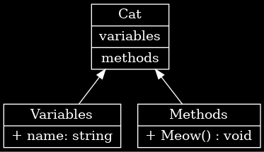

# Завдання:
> ## Ціль:
>>**Створити C# клас, згідно наданій діаграмі.**
> ## Діаграма яку потрібно відтворити у формі C# класу:
>>

# Приклад виконання:
>## Діаграма:
>>
>## Результат:
>>### Program.cs:
>>>```C#
>>>class Program {
>>>    static void Main() {
>>>        // Creating an instance of the Cat class
>>>        Cat myCat = new Cat("Whiskers");
>>>
>>>        // Calling the Meow method
>>>        myCat.Meow();
>>>    }
>>>}
>>>```
>>### Cat.cs:
>>>```C#
>>>public class Cat {
>>>    // Variable
>>>    private string name;
>>>
>>>    // Constructor
>>>    public Cat(string catName) {
>>>        name = catName;
>>>    }
>>>
>>>    // Method
>>>    public void Meow() {
>>>        Console.WriteLine($"{name} says: Meow!");
>>>    }
>>>}
>>>```

# Додатково:
>## Мої Контакти:
>>**Email:** red007masterwork@gmail.com<br>
>>**Discord:** red007master
>>**(Або Viber/Telegram)**
>>>### **При винекнені проблем з виконанням - пишіть.**
>## Здача:
>>### Як надсилати:
>>>Архів/Папка з файлами (бажано окремий для `Program` та `Car` і ТД)
>>### Куди надсилати:
>>>**Email:** - Архів або доступ до файлів на *Google Drive*.<br>
>>>**Viber:** - Посилання на *Google Drive* з файлами чи інший файлообмінник (Viber не друже з файлами).
