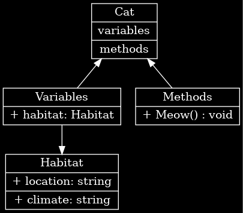

# Завдання:
>## Ціль:
>>**Створити C# клас, згідно наданій діаграмі.**
>## Діаграма яку потрібно відтворити у формі C# класу:
>>

# Приклад виконання:
>## Діаграма:
>>
>## Результат:
>>### Program.cs:
>>>```C#
>>>class Program {
>>>    static void Main() {
>>>        // Creating an instance of the Habitat class
>>>        Habitat catHabitat = new Habitat("Indoor", "Temperate");
>>>
>>>        // Creating an instance of the Cat class
>>>        Cat myCat = new Cat(catHabitat);
>>>
>>>        // Calling the Meow method
>>>        myCat.Meow();
>>>    }
>>>}
>>>```
>>### Cat.cs:
>>>```C#
>>>public class Cat {
>>>    // Variable
>>>    private Habitat habitat;
>>>
>>>    // Constructor
>>>    public Cat(Habitat catHabitat) {
>>>        habitat = catHabitat;
>>>    }
>>>
>>>    // Method
>>>    public void Meow() {
>>>        Console.WriteLine($"Meow! I live in {habitat.Location}.");
>>>    }
>>>}
>>>```
>>### Habitat.cs:
>>>```C#
>>>public class Habitat {
>>>    // Variables
>>>    private string location;
>>>    private string climate;
>>>
>>>    // Constructor
>>>    public Habitat(string loc, string clm) {
>>>        location = loc;
>>>        climate = clm;
>>>    }
>>>
>>>    // Properties
>>>    public string Location { get { return location; } }
>>>    public string Climate { get { return climate; } }
>>>}
>>>```

# Додатково:
>## Мої Контакти:
>>**Email:** red007masterwork@gmail.com
>>**Discord:** red007master
>>**(Або Viber)**
>>>###**При винекнені проблем з виконанням - пишіть.**
>## Здача:
>>### Як надсилати:
>>>Архів/Папка з файлами (бажано окремий для `Program` та `Car` і ТД)
>>### Куди надсилати:
->>>**Email:**
>>>>Архів або доступ до файлів на *Google Drive*.
->>>**Viber:**
>>>>Посилання на *Google Drive* з файлами чи інший файлообмінник ʼ(Viber не друже з файлами)ʼ.
